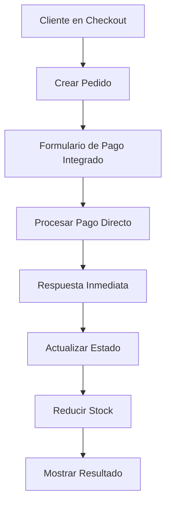

# Configuración de MercadoPago - Checkout API

## 🚀 Integración Completa de MercadoPago (Checkout API)

### ✅ Funcionalidades Implementadas

1. **Checkout API (Transparente)**
   - ✅ Formulario de pago integrado en la aplicación
   - ✅ No requiere validación de negocio
   - ✅ Experiencia de usuario sin redirecciones externas
   - ✅ Control total sobre el diseño

2. **Procesamiento de Pagos**
   - API route: `/api/mercadopago/process-payment`
   - API route: `/api/mercadopago/payment-methods`
   - Validación de stock antes del pago
   - Información del cliente desde Clerk

3. **Webhook para Notificaciones**
   - API route: `/api/mercadopago/webhook`
   - Actualización automática de estados
   - Reducción de stock al confirmar pago

4. **Páginas de Resultado**
   - `/checkout/payment` - Formulario de pago integrado
   - `/checkout/success` - Pago exitoso
   - `/checkout/failure` - Pago fallido
   - `/checkout/pending` - Pago pendiente

5. **Flujo Completo**
   - Checkout → Formulario Integrado → Confirmación Inmediata

### 🔧 Configuración Requerida

#### 1. Variables de Entorno

Agregar a tu archivo `.env.local`:

```bash
# MercadoPago
MERCADOPAGO_ACCESS_TOKEN=TEST-your_access_token_here
# Para producción: APP-your_production_access_token_here

# URL de tu aplicación (importante para webhooks)
NEXT_PUBLIC_APP_URL=http://localhost:3000
```

#### 2. Obtener Credenciales de MercadoPago

1. Crear cuenta en [MercadoPago Developers](https://www.mercadopago.com.ar/developers)
2. Ir a "Tus integraciones" → "Crear aplicación"
3. Copiar el **Access Token** de prueba (TEST-...)
4. **NO se requiere validación de negocio para Checkout API**

#### 3. Configurar Webhook (Opcional para Checkout API)

En el panel de MercadoPago:
1. Ir a "Webhooks"
2. Agregar URL: `https://tu-dominio.com/api/mercadopago/webhook`
3. Seleccionar eventos: `payment`

### 🧪 Testing

#### Tarjetas de Prueba

**Visa (Aprobada):**
- Número: `4509 9535 6623 3704`
- CVV: `123`
- Fecha: `11/25`
- Titular: `APRO`
- RUT: `12345678`

**Mastercard (Rechazada):**
- Número: `5031 7557 3453 0604`
- CVV: `123`
- Fecha: `11/25`
- Titular: `OTHE`
- RUT: `12345678`

#### Flujo de Prueba

1. Agregar productos al carrito
2. Ir a checkout
3. Llenar información de retiro
4. Click "Continuar al Pago"
5. Llenar formulario de tarjeta
6. Confirmar pago
7. Ver resultado inmediato
8. Verificar estado del pedido

### 📋 Estados de Pago

| MercadoPago | Base de Datos | Descripción |
|-------------|---------------|-------------|
| `approved` | `PAGADO` | Pago confirmado |
| `pending` | `PENDIENTE` | Esperando confirmación |
| `in_process` | `PENDIENTE` | Procesando pago |
| `rejected` | `CANCELADO` | Pago rechazado |
| `cancelled` | `CANCELADO` | Pago cancelado |

### 🔄 Nuevo Flujo Checkout API



### ✅ Ventajas del Checkout API

1. **Sin Validación de Negocio**: Funciona inmediatamente
2. **Experiencia Integrada**: Sin redirecciones
3. **Control Total**: Diseño personalizado
4. **Respuesta Inmediata**: Sin esperar webhooks
5. **Mejor UX**: Todo en la misma aplicación

### 🚨 Importante para Producción

1. **Cambiar Access Token** de TEST a APP
2. **Implementar tokenización real** (reemplazar token simulado)
3. **Configurar webhook** para redundancia
4. **Verificar SSL** en el servidor
5. **Monitorear logs** de pagos

### 🐛 Debugging

#### Logs de Pago
```bash
# Ver logs en desarrollo
npm run dev

# Buscar en logs:
# "Payment processed:"
# "Order updated to status:"
```

#### Test de Formulario
- Usar tarjetas de prueba
- Verificar validaciones
- Probar diferentes escenarios

### 📞 Soporte

- [Documentación Checkout API](https://www.mercadopago.com.ar/developers/es/docs/checkout-api/landing)
- [SDK Node.js](https://github.com/mercadopago/sdk-nodejs)
- [Tarjetas de Prueba](https://www.mercadopago.com.ar/developers/es/docs/checkout-api/testing)

---

¡Checkout API está listo para usar sin validación de negocio! 🎉 